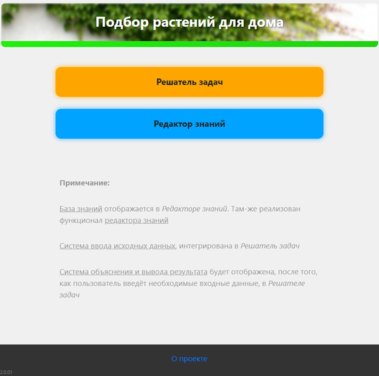
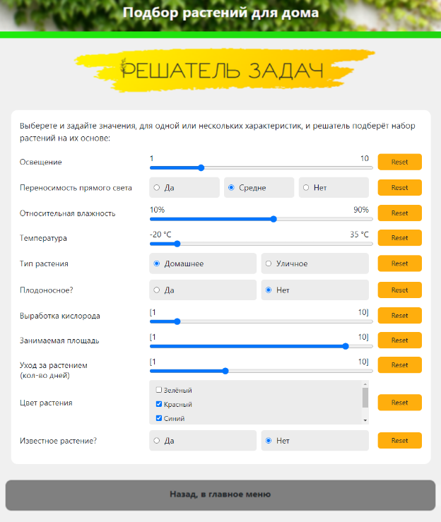
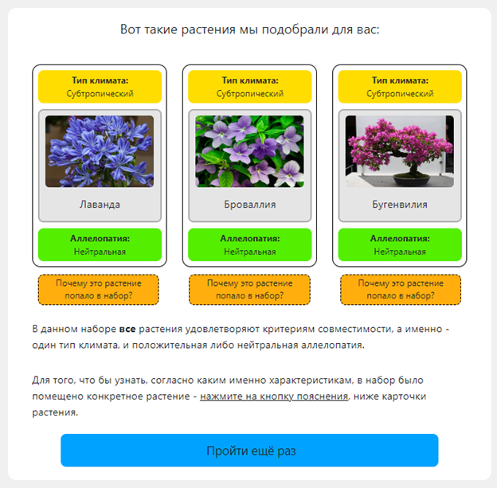
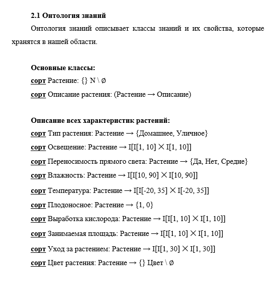

### 🪴 Расширенный проект сайта с подбором растений: Добавлен редактор базы данных, и переработан вид ввода данных

Оригинальный проект, и его более подробное описание доступны в этом репозитории: https://github.com/GogikOrtey/PRIS_Project_Main

В этом проекте была добавлена страница Редактор знаний - там можно в пользовательском интерфейсе просмотреть и изменить характеристики всех хранящихся там растений, а также удалять записи, и создавать новые

Была переработана страница ввода значения: Теперь там не диалоговый режим, а ползунки и кнопки, которые видно все сразу. Можно выбрать те характеристики, которые необходимо настроить, и поиск растений будет произведён по ним

---

**Интерфейс сайта:**

---

Данный проект также был описан при помощи онтологии:

